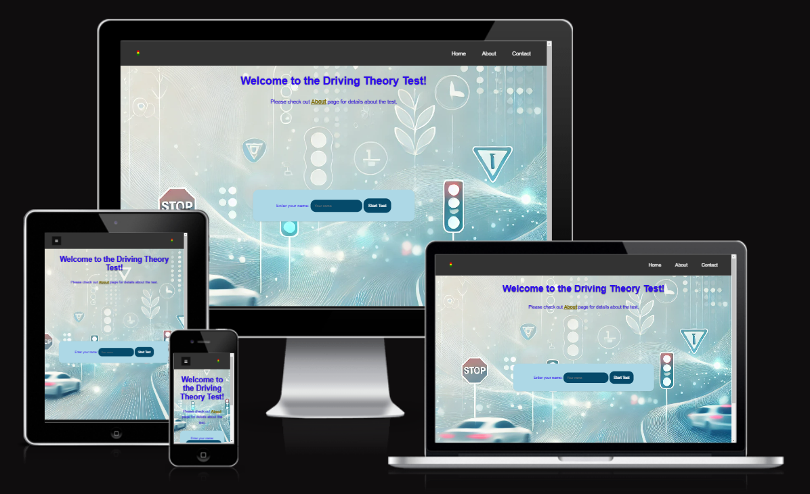
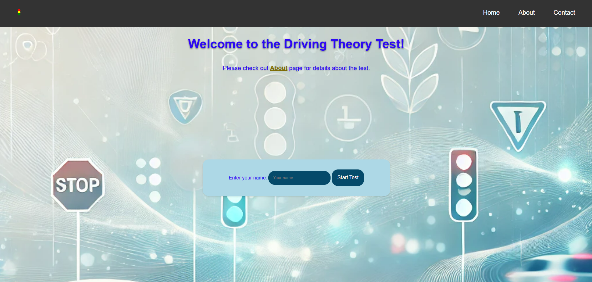
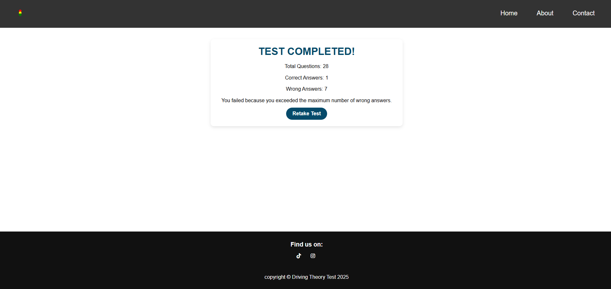
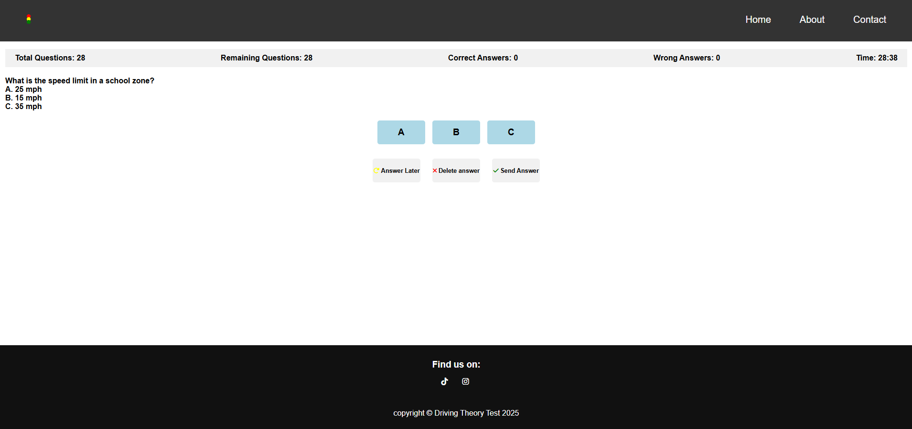
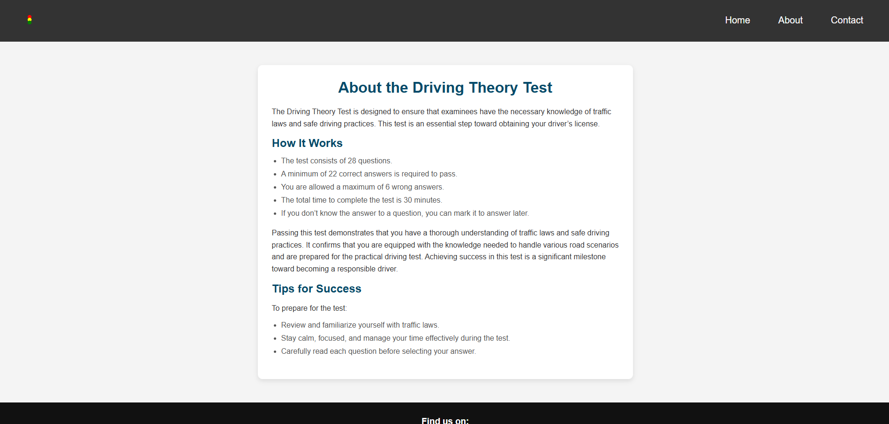
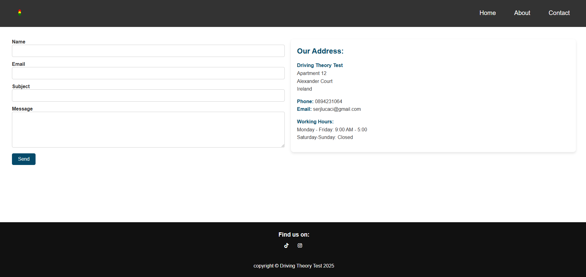
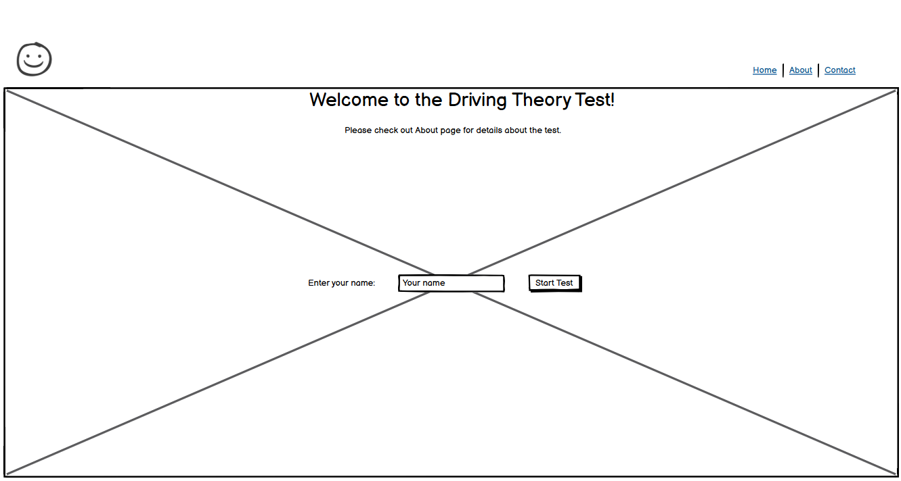
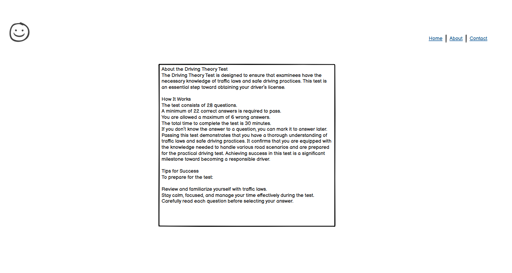
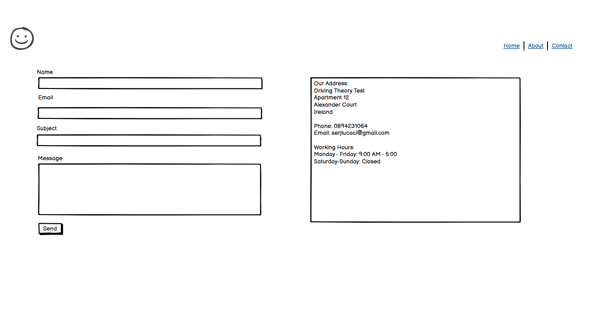

# Driving Theory Test

Visit the site deployed on GitHub: [Driving Theory Test](https://slucaci.github.io/js-project/)

# CONTENTS

- [User Experience](#user-experience)

  - [User Stories](#user-stories)

- [How To use](#how-to-use)

- [Design](#design)

  - [Colour Scheme](#colour-scheme)
  - [Typography](#typography)
  - [Wireframes](#wireframes)
  - [Accessibility](#accessibility)

- [Features](#features)

  - [Existing Features](#existing-features)
  - [Future Features](#future-features)

- [Bugs](#bugs)

  - [Solved Bugs](#solved-bugs)
  - [Remaining Bugs](#remaining-bugs)

- [Technologies Used](#technologies-used)

  - [Languages Used](#languages-used)
  - [Frameworks, Libraries & Programs Used](#frameworks-libraries--programs-used)

- [Deployment & Local Development](#deployment--local-development)

  - [Deployment](#deployment)
  - [Local Development](#local-development)
    - [How to Fork](#how-to-fork)
    - [How to Clone](#how-to-clone)

- [Testing](#testing)
- [Credits](#credits)

## User Experience

### User Stories

1. As a first-time visitor

   - I want to understand the purpose of the app and how it works
   - I want to navigate through the app easily and access the test page without confusion

2. As a returning user
   - I want the ability to retake the test and see a new set of random questions

## How To Use

### Home Page

- Enter your name in the provided input field.
- Click the Start Test button.
- After submitting, you will be redirected to the test page.
- On the test page, respond to the questions presented.
- Once all questions are completed, or if you reach the maximum limit of 6 incorrect answers, the result will be displayed.

### Test page

- Open the website.
- Read the rules for the test on the about.html page.
- Navigate to the home.html page and enter your name.
- Click the Start Test button to begin.
- During the test, you can use the Answer Later button to skip a question and revisit it later
- To delete all selected answers, you can either press the "A," "B," or "C" buttons again to deselect them, or use the **Delete Answer** button to clear all selections at once

### About Page

- Open the About Page to read detailed information about the test.
- Familiarize yourself with the rules and guidelines provided to ensure you understand the process.
- Use the navigation links or buttons on the page to proceed to the Home Page when you're ready to start.

### Contact Page

- Fill out the contact form with your details.
- Submit the form and wait for a response.

### Color Scheme

| **Color Name** | **Hex Code**

| **Dark Gray** | `#333`  
| **Black** | `#111`  
| **Light Blue** | `#add8e6`  
| **Orange** | `#ff8c00`  
| **Green** | `#008000`  
| **Red** | `#FF0000`  
| **Yellow** | `#FFD700`
| **Light Gray** | `#f1f1f1`  
| **Off White** | `#f4f4f4`  
| **Medium Gray** | `#818181`  
| **Light Gray Border** | `#cccccc`

### Typography

The Driving Theory Test uses the Roboto font family, which is clean, modern, and easy to read.

- Backup Fonts

  The following backup font is used in case the primary font is unavailable:
  sans-serif

### Wireframes

I used balsamiq for wireframes.

**Home page**

**About page**

**Contact page**

## Features

### Existing Features

#### 1. Test Page

- Users can access the test page through the website.
- Provides clear instructions about the test on the **about.html** page.
- Allows users to input their name on the **index.html** page before starting the test.
- Includes a "Start Test" button to begin the test process

#### 2. Contact Page

- A dedicated contact form allows users to provide their details for inquiries or feedback
- The form validates input to ensure all required fields are completed
- The form sends a real email using **EmailJS** for seamless email functionality

#### 3. Responsive Design

- The website is fully responsive across different screen sizes.
- Layout adapts for mobile, tablet, and desktop.

#### 4. User-Friendly Navigation

- Intuitive navigation bar for easy access to the Home Page, About Page, and Contact Page.
- Clear instructions provided on each page to guide users.

### Future Features

#### 1. User Accounts

- Enable users to create accounts to save their test progress and history.
- Allow users to review past test results and track their performance over time.

#### 2. Multi-Language Support

- Expand the platform to support multiple languages, making it accessible to a wider audience.
- Allow users to switch between languages seamlessly.

#### 3. Mobile Application

- Develop a mobile app for Android and iOS
- Include offline mode functionality for users to take tests without internet.

## Bugs

### Solved Bugs

1. Fixed input validation.

   - The program didn't handle empty or invalid inputs.
   - To solve this bug, input was checked for empty entries and a message is displayed.

2. Fixed random question duplication
   - The same question appeared multiple times in a single test session.
   - Updated the random question generation logic to shuffle the question pool and ensure unique selection
3. Fixed non-responsive mobile navigation
   - The navigation menu was not functioning correctly on smaller screens.
   - Added a responsive mobile navigation menu and resolved JavaScript errors in the openNav() and closeNav() functions
4. Fixed incorrect answer validation
   - The app marked correct answers as incorrect for some multiple choice questions
   - Adjusted the answer validation logic to handle multiple correct answers properly

### Remaining Bugs

- No known remaining bugs.

## Technologies Used

#### Languages Used

HTML, CSS and JavaScript, EmailJs.

#### Frameworks, Libraries & Programs Used

- [README Editor](https://readme.so/editor) - to write the code for readme file
- [ Visual Studio](https://code.visualstudio.com/) - to write the HTML/CSS/JS code

- [ Prettier](https://marketplace.visualstudio.com/items?itemName=esbenp.prettier-vscode) - a VSCode Extension to format the code

- [Balsamiq](https://balsamiq.com/) - for the wireframes.

- [Cloud Convert](https://cloudconvert.com/webp-converter) - to convert the images into the webp format

- [Github](https://github.com/) - to manage the website

- [Google Fonts](https://fonts.google.com/)

- [Developer Tools](https://developer.chrome.com/docs/devtools) - to arrange the items on the page, to view the pages on different formats

## Deployment & Local Development

### Deployment

The site is deployed using GitHub Pages on - [Driving Theory Test](https://slucaci.github.io/js-project/)

Steps to deploy on github pages:

1. Login to your Github Account
2. Go to: [slucaci/js-project](https://github.com/slucaci/js-project).
3. Click the settings button in the middle top of the page
4. Select pages in the left hand side
5. Select main branch and press save.
6. The site is deployed and live using github.

The site is deployed using GitHub Pages on - [GymTracker](https://slucaci.github.io/JavaScriptProject/index.html)

Steps to deploy on github pages:

1. Login to your Github Account
2. Go to: [slucaci/HTMLCSS](https://slucaci.github.io/JavaScriptProject/index.html).
3. Click the settings button in the middle top of the page
4. Select pages in the left hand side
5. Select main branch and press save.
6. The site is deployed and live using github.

### Local Development

#### How to Fork

To fork the repository:

1. Login to your Github Account.
2. Go to: [slucaci/js-project](https://github.com/slucaci/js-project)
3. Click the Fork button in the top right corner.

#### How to Clone

To clone the repository:

1. Login to your Github Account.
2. Go to: [slucaci/js-project](https://github.com/slucaci/js-project)
3. On the repository's main page, find the green "Code" button located towards the right side of the page.
4. Copy the URL provided in the textbox.
5. Type 'git clone' into the terminal and then paste the link you copied in step 4. Press enter.

## Testing

Check the [TESTING.md](TESTING.md) file for a detailed summary of all testing procedures conducted.

## Credits

- The Slack channel from Code Institute provided helpful answers to my questions during the project.
- **Code Institute Course:** A valuable resource for learning and building this project.
- [CodeEasy](https://www.youtube.com/watch?v=BgVjild0C9A&t=322s&ab_channel=CodeEasy) Guided me on how to implement EmailJS for email functionality.
- [W3school](https://www.w3schools.com/howto/tryit.asp?filename=tryhow_js_collapse_sidebar) Helped me learn how to code a collapsible sidebar.
- [W3schools](https://www.w3schools.com/jsref/jsref_random.asp) Provided insights on generating random questions using JavaScript.
