# Gym Tracker

Visit the site deployed on github: [GymTracker](https://slucaci.github.io/JavaScriptProject/index.html)

## CONTENTS

- [AUTOMATED TESTING](#AUTOMATED-TESTING)

  - [W3C Validator](#W3C-Validator)

  - [Jshint](#jshint)

  - [Lighthouse](#Lighthouse)

- [MANUAL TESTING](#MANUAL-TESTING)

  - [Testing User Stories](#Testing-User-Stories)

## AUTOMATED TESTING

### W3C Validator

[HTML W3C](https://validator.w3.org/) was used to validate the HTML code.

- [Home Page](https://slucaci.github.io/js-project/index.html) - 0 errors
  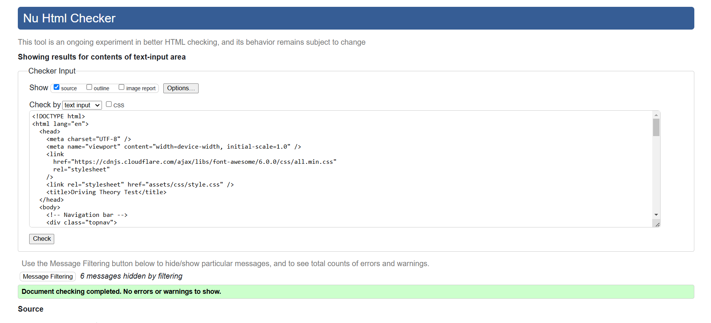
- [Test Page](https://slucaci.github.io/js-project/test.html) - 0 erros
  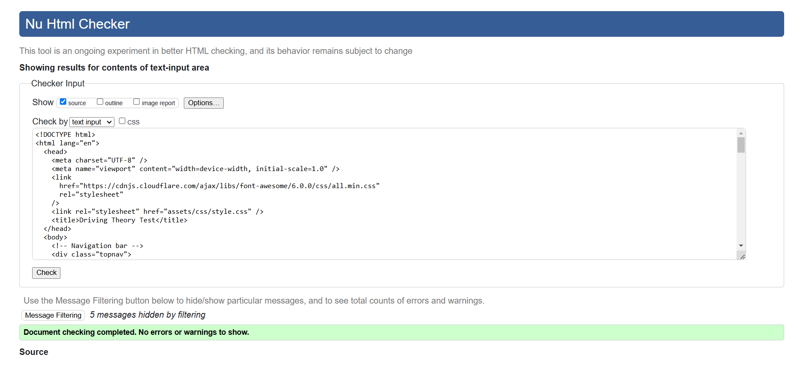
- [About Page](https://slucaci.github.io/js-project/about.html) - 0 errors
  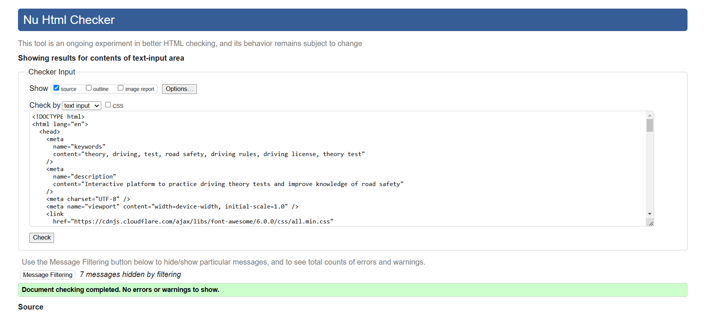
- [Contact Page](https://slucaci.github.io/js-project/contact.html) - 0 errors
  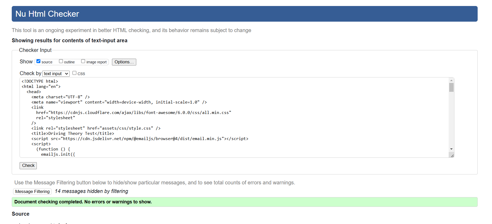

### Jshint

[Jshint](https://jshint.com/) to validate JS Code - 0 errors
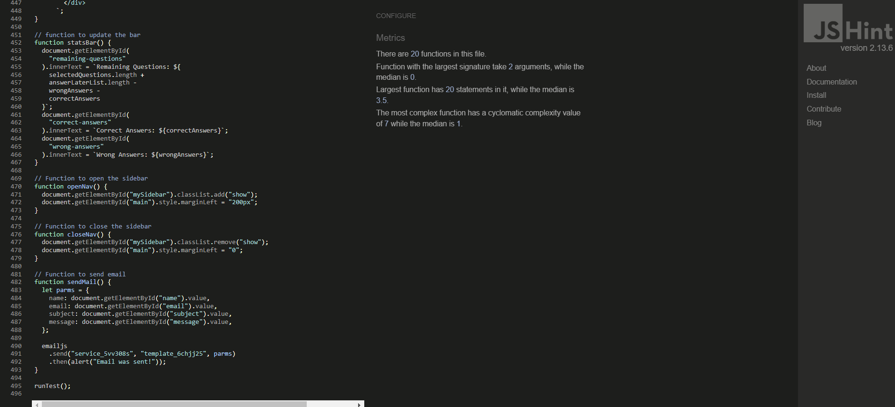

[ CSS W3C](https://jigsaw.w3.org/css-validator/) was used to validate the CSS code.
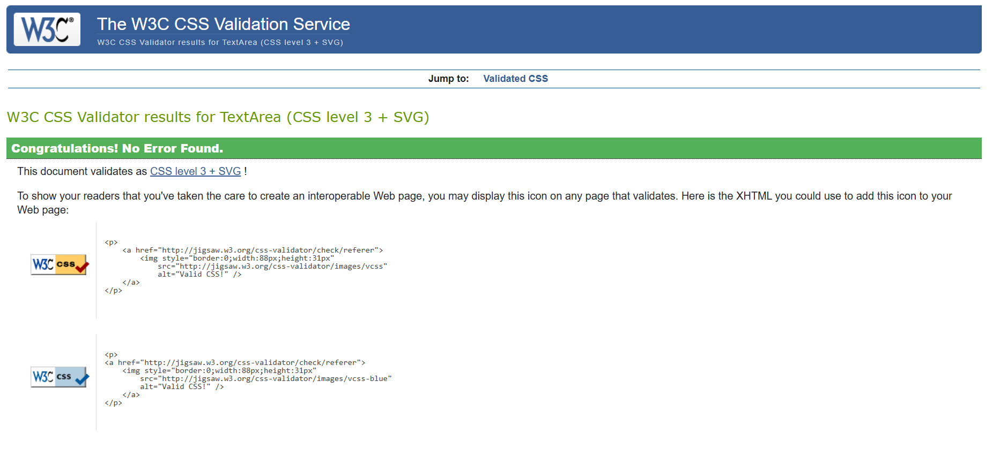

### LightHouse

I have used developer tools Lighthouse to do tests on my website pages on mobile and desktop version.

#### Desktop Version

**Home page**
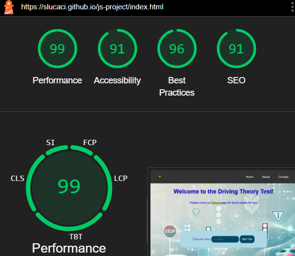
**Test page**
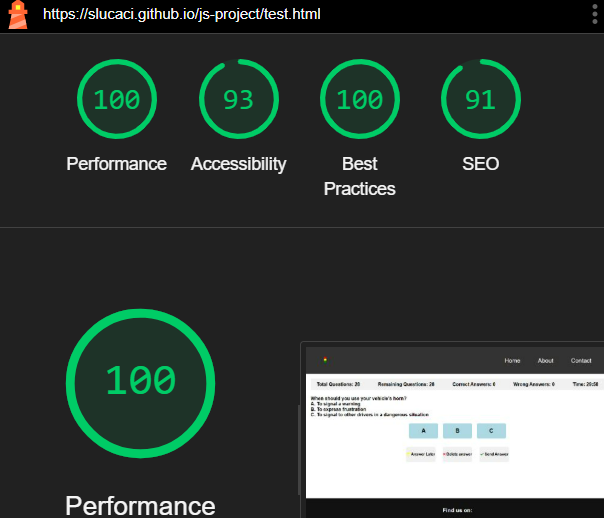
**About page**
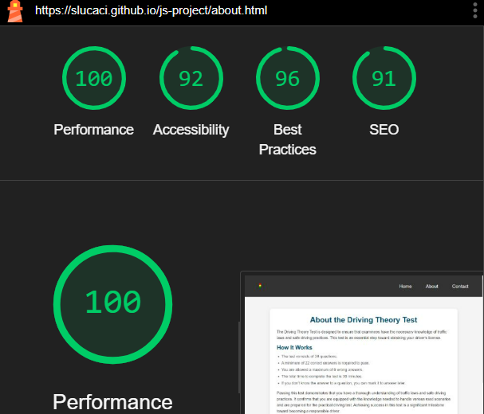
**Contact page**
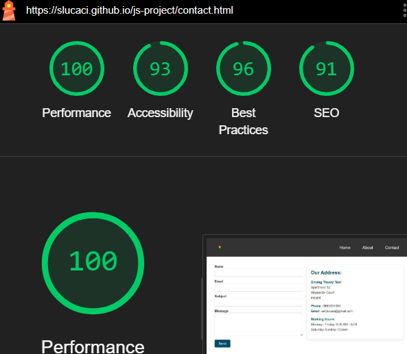

#### Mobile Version

**Home page**
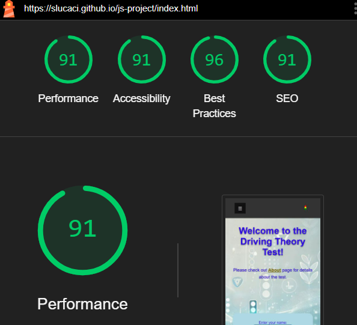
**Test page**

**About page**
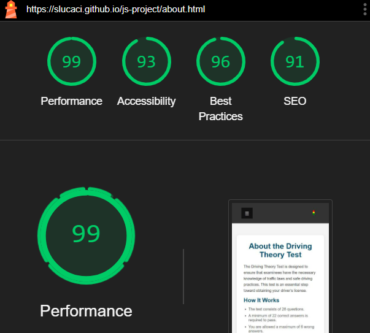
**Contact page**
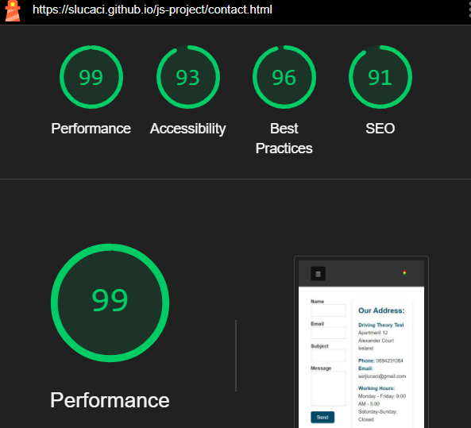

## Manual Testing

#### Navigation Test:

1. Click on each navigation link (Home, About, Contact) in the header navigation bar.
2. Verify that each link redirects to the corresponding page without any errors.
3. Ensure that the active link is visually distinguished from the other links.

#### Start Test

1. Try to start the test with an empty field.
2. An alert message will be displayed prompting you to enter your name.

#### Submit answer

1. Try to submit an answer without selecting any option
2. An alert message will be displayed prompting you to select an answer

#### Delete answer

1. Try to delete an answer without selecting any option
2. An alert message will be displayed prompting you to select an answer

#### Responsive Design:

- Objective: Test the website's responsiveness across different devices and screen sizes.
- Steps:

1. Open the website on a desktop/laptop computer with a standard screen size.
2. Resize the browser window to simulate smaller screen sizes (tablet, mobile).
3. Check if the website layout adjusts accordingly, ensuring readability and usability on all devices.
   Test any interactive elements to ensure they function properly on different devices.

#### Footer Icons Test

1. Verify that the social media icons in the footer are clickable.
2. Click on each social media icon (TikTok, Instagram) and confirm that it opens the respective social media profile in a new tab/window.

#### Form Test

1. Find the form on "Contact" Page
2. Try to press the submit button with 1 empty field
3. Form will not send because all the fields are mandatory
